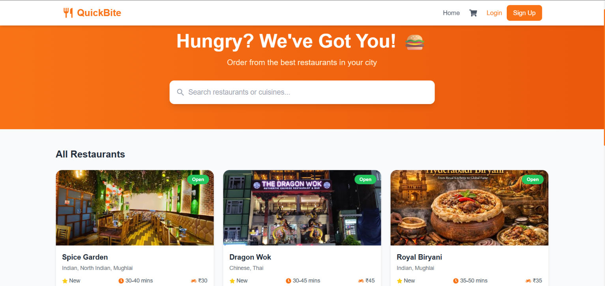
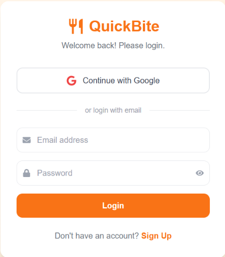
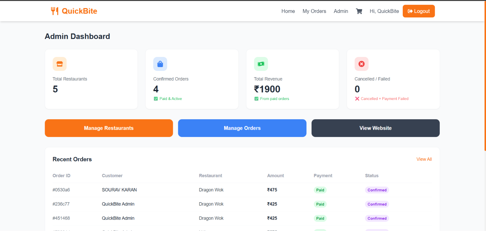

<div align="center">

# 🍔 QuickBite

### A Full-Stack Food Delivery Web Application

QuickBite is a MERN-stack food ordering platform inspired by Swiggy and Zomato — users can browse restaurants, explore menus, place orders, pay online, and track deliveries in real time, while admins manage the entire catalog from a dedicated dashboard.

[](https://quick-bite-alpha-six.vercel.app)
[](https://github.com/souravkaran988/QuickBite/stargazers)
[](https://github.com/souravkaran988/QuickBite/commits/main)

[](https://react.dev/)
[](https://nodejs.org/)
[](https://expressjs.com/)
[](https://www.mongodb.com/)
[](https://tailwindcss.com/)
[](https://socket.io/)
[](https://vercel.com/)
[](https://render.com/)

**[🔗 Live App](https://quick-bite-alpha-six.vercel.app)** · **[🐛 Report Bug](https://github.com/souravkaran988/QuickBite/issues)** · **[✨ Request Feature](https://github.com/souravkaran988/QuickBite/issues)**

</div>

<div align="center">
  
</div>

---

## 📋 Table of Contents

- [About the Project](#-about-the-project)
- [Screenshots](#-screenshots)
- [Key Highlights](#-key-highlights)
- [Features](#-features)
- [Tech Stack](#️-tech-stack)
- [Architecture](#-architecture)
- [Project Structure](#-complete-file-structure)
- [Getting Started](#-getting-started-local-setup)
- [Deployment](#-deployment-guide)
- [Challenges & What I Learned](#-challenges--what-i-learned)
- [API Overview](#️-api-overview)
- [Roadmap](#-roadmap)
- [Contributing](#-contributing)
- [Contact](#-contact)

---

## 📖 About the Project

QuickBite is a full-stack, production-style food delivery platform built end-to-end — from database design to a live, deployed application. It replicates the core experience of apps like Swiggy and Zomato: users can discover restaurants near them, browse menus, add items to a cart, check out securely, and follow their order in real time as it moves through the kitchen to delivery.

Beyond the customer-facing app, QuickBite includes a full **admin dashboard** so restaurant/menu data can be managed without ever touching the database directly — a detail that matters in any real-world product.

This project was taken from a base codebase and independently **debugged, reconfigured, secured, and deployed from scratch** — including migrating to a personal database, fixing hardcoded environment issues, resolving CORS and networking errors, and shipping it live on Vercel + Render.

> 🔗 **Try it live:** [quick-bite-alpha-six.vercel.app](https://quick-bite-alpha-six.vercel.app)
> **Demo admin login:** `admin@quickbite.com` / `admin123`

---

## 📸 Screenshots

<div align="center">

| Login | Admin Dashboard |
|---|---|
|  |  |

</div>

> 📌 **Adding your own screenshots:** drop PNG/JPG files into a `screenshots/` folder in the project root (`home.png`, `login.png`, `admin-dashboard.png`) — GitHub renders them automatically here.

---

## 🌟 Key Highlights

- ⚡ **End-to-end deployment** — live frontend (Vercel), live backend (Render), and cloud database (MongoDB Atlas), fully wired together with environment-based configuration
- 🔐 **Dual authentication** — traditional email/password with JWT, plus Google OAuth via Passport.js
- ⏱️ **Real-time updates** — Socket.io powers live order status tracking without page refreshes
- 💳 **Real payment integration** — Razorpay checkout flow, not a mock
- 🖼️ **Cloud image handling** — Cloudinary + Multer for restaurant/menu image uploads
- 🛡️ **Environment-safe secrets** — all credentials kept out of version control via `.gitignore`, injected through platform environment variables in production
- 🧩 **Clean separation of concerns** — distinct `client`/`server` codebases, MVC-style backend (routes → controllers → models)

---

## ✨ Features

### 👤 For Customers
- 🔐 Secure signup/login with email & password or **Google OAuth**
- 🏪 Browse restaurants with search and filtering
- 📋 View detailed restaurant menus with images
- 🛒 Add items to cart, adjust quantities, and checkout
- 💳 Secure online payments via **Razorpay**
- 📦 **Real-time order tracking** with live status updates (Socket.io)
- 🧾 View past order history

### 👨‍💼 For Admins
- 🏪 Add, edit, and delete restaurants
- 🍽️ Manage menu items per restaurant (with image upload via Cloudinary)
- 📦 View and update order statuses
- 📊 Centralized admin dashboard

---

## 🛠️ Tech Stack

| Layer | Technologies |
|---|---|
| **Frontend** | React 19 · Vite · Redux Toolkit · React Router v7 · Tailwind CSS · Axios · Socket.io-client · React Hot Toast |
| **Backend** | Node.js · Express.js · MongoDB (Mongoose) · JWT · Passport.js (Google OAuth) · Socket.io |
| **File Storage** | Cloudinary (via Multer) |
| **Payments** | Razorpay |
| **Deployment** | Vercel (frontend) · Render (backend) · MongoDB Atlas (database) |

---

## 🏗️ Architecture

```
┌─────────────────┐        HTTPS / REST         ┌──────────────────┐
│   React Client    │ ───────────────────────────▶ │   Express Server   │
│   (Vercel)         │ ◀─────────────────────────── │   (Render)          │
└─────────────────┘        JSON responses         └──────────────────┘
                                                              │
                            ┌─────────────────────────────────┼──────────────────────┐
                            ▼                                  ▼                      ▼
                    ┌───────────────┐              ┌────────────────┐      ┌──────────────────┐
                    │  MongoDB Atlas  │              │   Cloudinary     │      │     Razorpay       │
                    │   (database)     │              │ (image storage)   │      │  (payments)          │
                    └───────────────┘              └────────────────┘      └──────────────────┘

Real-time layer: Socket.io connects client ⇄ server directly for live order-status pushes.
```

---

## 📁 Complete File Structure

```
QuickBite/
│
├── client/                              # React frontend (Vite)
│   ├── public/
│   │   ├── favicon.svg
│   │   └── icons.svg
│   ├── src/
│   │   ├── assets/
│   │   │   ├── hero.png
│   │   │   ├── react.svg
│   │   │   └── vite.svg
│   │   ├── components/
│   │   │   ├── AdminRoute.jsx           # Protects admin-only routes
│   │   │   ├── Footer.jsx
│   │   │   ├── Navbar.jsx
│   │   │   └── ProtectedRoute.jsx       # Protects authenticated routes
│   │   ├── pages/
│   │   │   ├── admin/
│   │   │   │   ├── AdminDashboard.jsx
│   │   │   │   ├── AdminMenuItems.jsx
│   │   │   │   ├── AdminOrders.jsx
│   │   │   │   └── AdminRestaurants.jsx
│   │   │   ├── AuthSuccess.jsx          # Handles Google OAuth redirect
│   │   │   ├── Cart.jsx
│   │   │   ├── Checkout.jsx
│   │   │   ├── Home.jsx
│   │   │   ├── Login.jsx
│   │   │   ├── OrderHistory.jsx
│   │   │   ├── OrderTracking.jsx
│   │   │   ├── Register.jsx
│   │   │   └── RestaurantDetail.jsx
│   │   ├── redux/
│   │   │   ├── slices/
│   │   │   │   ├── authSlice.js
│   │   │   │   └── cartSlice.js
│   │   │   └── store.js
│   │   ├── utils/
│   │   │   └── axios.js                 # Configured Axios instance
│   │   ├── App.css
│   │   ├── App.jsx                      # Route definitions
│   │   ├── index.css                    # Tailwind + global styles
│   │   └── main.jsx                     # App entry point
│   ├── .env                             # (not committed) frontend secrets
│   ├── .gitignore
│   ├── eslint.config.js
│   ├── index.html
│   ├── package.json
│   ├── postcss.config.js
│   ├── tailwind.config.js
│   └── vite.config.js
│
├── server/                              # Express backend
│   ├── config/
│   │   ├── cloudinary.js                # Cloudinary storage config
│   │   ├── db.js                        # MongoDB connection
│   │   └── passport.js                  # Google OAuth strategy
│   ├── controllers/
│   │   ├── authController.js
│   │   ├── menuController.js
│   │   ├── orderController.js
│   │   ├── paymentController.js
│   │   └── restaurantController.js
│   ├── middleware/
│   │   ├── authMiddleware.js            # JWT verification
│   │   └── uploadMiddleware.js          # Multer + Cloudinary upload
│   ├── models/
│   │   ├── MenuItem.js
│   │   ├── Order.js
│   │   ├── Restaurant.js
│   │   └── User.js
│   ├── routes/
│   │   ├── authRoutes.js
│   │   ├── menuRoutes.js
│   │   ├── orderRoutes.js
│   │   ├── paymentRoutes.js
│   │   └── restaurantRoutes.js
│   ├── .env                             # (not committed) backend secrets
│   ├── .gitignore
│   ├── index.js                         # Server entry point
│   ├── package.json
│   └── seed.js                          # Seeds an admin user into the DB
│
├── screenshots/                         # README screenshots
├── .gitignore                           # Root-level ignore rules
└── README.md
```

---

## 🚀 Getting Started (Local Setup)

### Prerequisites
- [Node.js](https://nodejs.org/) v18 or higher
- npm
- A free [MongoDB Atlas](https://www.mongodb.com/atlas) account

### 1. Clone the repository
```bash
git clone https://github.com/souravkaran988/QuickBite.git
cd QuickBite
```

### 2. Backend Setup

```bash
cd server
npm install
```

Create a `.env` file inside `server/`:

```env
PORT=5000

MONGO_URI=your_mongodb_connection_string
JWT_SECRET=your_jwt_secret

GOOGLE_CLIENT_ID=your_google_client_id
GOOGLE_CLIENT_SECRET=your_google_client_secret
GOOGLE_CALLBACK_URL=http://localhost:5000/api/auth/google/callback

RAZORPAY_KEY_ID=your_razorpay_key_id
RAZORPAY_KEY_SECRET=your_razorpay_key_secret

CLOUDINARY_CLOUD_NAME=your_cloudinary_cloud_name
CLOUDINARY_API_KEY=your_cloudinary_api_key
CLOUDINARY_API_SECRET=your_cloudinary_api_secret

CLIENT_URL=http://localhost:5173
```

> ⚠️ **MongoDB Atlas SRV connection issue:** On some networks, the `mongodb+srv://` connection string fails with a `querySrv ECONNREFUSED` error because the network's DNS resolver blocks SRV lookups. If you hit this, go to Atlas → **Connect → Drivers**, toggle **off** "SRV Connection String", and use the standard `mongodb://` string with explicit shard hostnames instead.

Seed the database with a default admin user:
```bash
node seed.js
```
| Field | Value |
|---|---|
| Email | `admin@quickbite.com` |
| Password | `admin123` |

Start the backend:
```bash
npm run dev
```
Runs on **http://localhost:5000**

### 3. Frontend Setup

Open a new terminal:
```bash
cd client
npm install
```

Create a `.env` file inside `client/`:
```env
VITE_API_URL=http://localhost:5000/api
VITE_RAZORPAY_KEY_ID=your_razorpay_key_id
```

Start the frontend:
```bash
npm run dev
```
Runs on **http://localhost:5173**

---

## 🌐 Deployment Guide

### Backend → Render
1. Create a **Web Service** on [Render](https://render.com), connected to this repo
2. **Root Directory:** `server`
3. **Build Command:** `npm install`
4. **Start Command:** `npm start`
5. Add all backend environment variables (see above) — set `CLIENT_URL` to your live frontend URL

### Frontend → Vercel
1. Import this repo on [Vercel](https://vercel.com)
2. **Root Directory:** `client`
3. Add environment variables: `VITE_API_URL` (your Render backend URL + `/api`) and `VITE_RAZORPAY_KEY_ID`
4. Deploy

### ✅ Post-deployment checklist
- [ ] Add your live frontend URL to the `origin` array in `server/index.js` (CORS config)
- [ ] Update `CLIENT_URL` in Render's environment variables to your live frontend URL
- [ ] Update `GOOGLE_CALLBACK_URL` in Render env vars **and** Google Cloud Console OAuth settings to your live backend URL
- [ ] Replace hardcoded `localhost` URLs anywhere in the client code with `import.meta.env.VITE_API_URL`

---

## 🧠 Challenges & What I Learned

Building and *shipping* QuickBite surfaced a lot of real-world engineering problems that don't show up in tutorials:

- **DNS/SRV connection failures** — MongoDB Atlas's default `mongodb+srv://` connection string failed on certain networks with `querySrv ECONNREFUSED`. Diagnosed it as a DNS SRV-record resolution issue and resolved it by switching to the standard non-SRV connection string format.
- **Hardcoded environment values breaking production** — the frontend's Axios instance and OAuth redirect URLs were hardcoded to `localhost`, which worked locally but silently broke in production. Fixed by routing all API URLs through Vite's `import.meta.env` environment variables.
- **CORS misconfiguration after deployment** — the deployed frontend couldn't talk to the deployed backend until the Express CORS `origin` allow-list was updated to include the live Vercel domain.
- **Wrong Root Directory on Render** — an early backend deploy silently installed the wrong `package.json` (a stray root-level one) because the platform's Root Directory setting wasn't pointed at `server/`, causing a `Missing script: "start"` failure.
- **Protecting secrets in version control** — set up proper `.gitignore` rules across both `client/` and `server/` *before* the first commit, so real database credentials, JWT secrets, and API keys never touched GitHub history.

---

## 🗺️ API Overview

| Method | Endpoint | Description |
|---|---|---|
| POST | `/api/auth/register` | Register a new user |
| POST | `/api/auth/login` | Login with email & password |
| GET | `/api/auth/google` | Start Google OAuth flow |
| GET | `/api/restaurants` | Get all restaurants |
| GET | `/api/menu/:restaurantId` | Get menu items for a restaurant |
| POST | `/api/orders` | Place a new order |
| GET | `/api/orders/my-orders` | Get logged-in user's order history |
| POST | `/api/payment/create-order` | Create a Razorpay payment order |

---

## 🧭 Roadmap

- [ ] Move session storage off in-memory store to a production-ready store (e.g. Redis) for scalable Google OAuth sessions
- [ ] Add restaurant ratings & reviews
- [ ] Add live delivery-partner location tracking on a map
- [ ] Add unit/integration tests for backend controllers
- [ ] Add a CI/CD pipeline (GitHub Actions) for automated deploys

---

## 🤝 Contributing

Contributions, issues, and feature requests are welcome!
1. Fork the repo
2. Create your feature branch (`git checkout -b feature/amazing-feature`)
3. Commit your changes (`git commit -m 'Add some amazing feature'`)
4. Push to the branch (`git push origin feature/amazing-feature`)
5. Open a Pull Request

---

## 📞 Contact

**Sourav Karan**

[](https://github.com/souravkaran988)
[](https://quick-bite-alpha-six.vercel.app)

📍 Kolkata, West Bengal, India

---

<div align="center">

⭐ **If you found this project useful or interesting, consider giving it a star!**

</div>